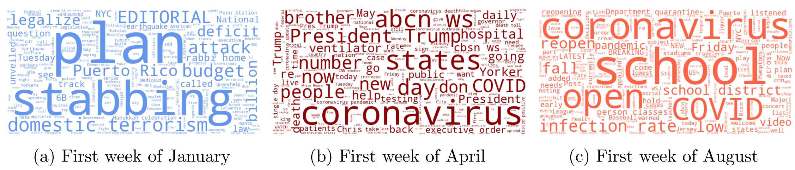
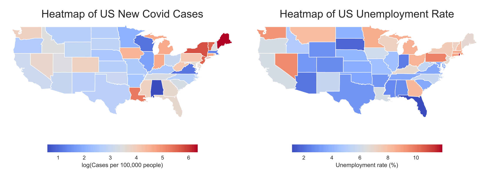
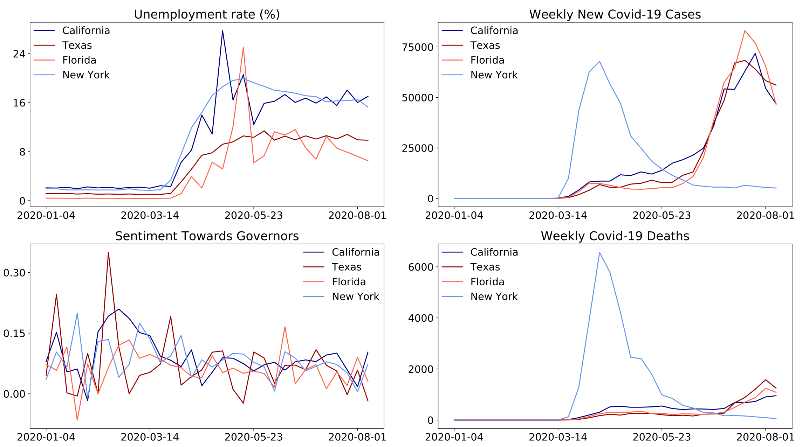
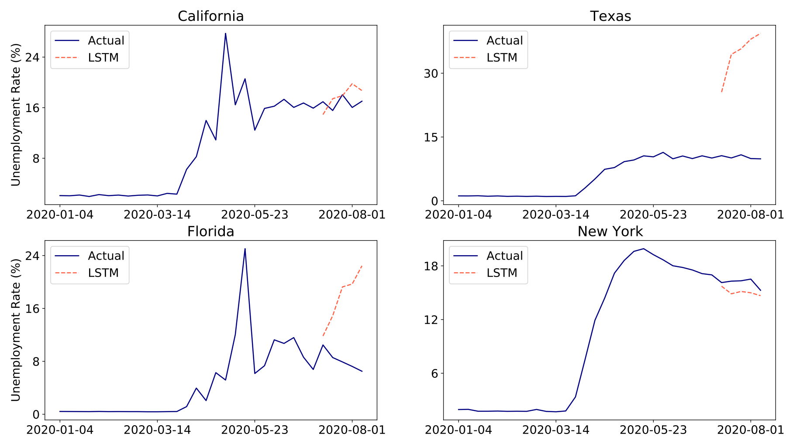
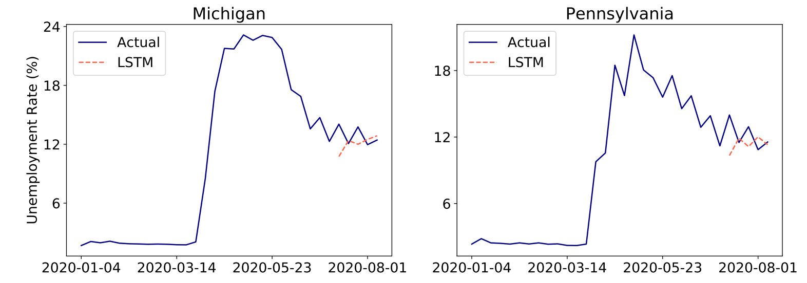

# Predicting unemployment rates with Twitter sentiment
A recurrent LSTM neural network takes as input weekly US unemployment rates, twitter sentiment scores and covid-19 cases to predict one-week-ahead unemployment rates.

### Objective
With the goal of predicting weekly, state-level unemployment rates in the US, the LSTM takes in as input the past week's rates, state-level Twitter sentiment variable along with new weekly covid-19 cases and covid-19 related deaths:

### Check out the .ipynb notebook file for a full walk-through!

### Twitter data
State-level Twitter data from various major and local news companies were extracted on a weekly basis. News tweets containing the handle of the governor in each state were stored. 

As an example, consider the news tweets in three different weeks of 2020 for New York containing the twitter handle of Governor Andrew Cuomo ([@NYGovCuomo](https://twitter.com/NYGovCuomo)):

The TextBlob sentiment analysis lexicon was used to compute sentiment scores representing the general sentiment towards the governor in each state. 

### All time-series data
The weekly US unemployment rates and covid-19 data was scraped from [Worldometer](https://www.worldometers.info/coronavirus/usa/) and the [United States Department of Labor](https://oui.doleta.gov/unemploy/claims.asp). The heatmap below represents the data from the first week of **April, 2020**:

Ultimately, the following four time-series were fed as input data to the LSTM network. The plots below show these time-series data from a few US states.   

### LSTM predictions

For each state, the LSTM network tries to predict the weekly unemployment rate in that state, .

The network shows good predictive ability in some states, however it make very poor predictions in states that kept unemployment rates relatively low despite high numbers of covid-19 cases, such as Texas and Florida. 

### Main take-aways
The recurrent neural network of the LSTM is a powerful tool for predictive time-series modeling.

Lagged variables of weekly unemployment rates, twitter sentiment and covid-19 cases can be used to predict one-week-ahead unemployment rates in US states, however it may prove difficult to explain the variability in predictive of some states, due to the more-or-less black box nature of the LSTM in this setting. 

